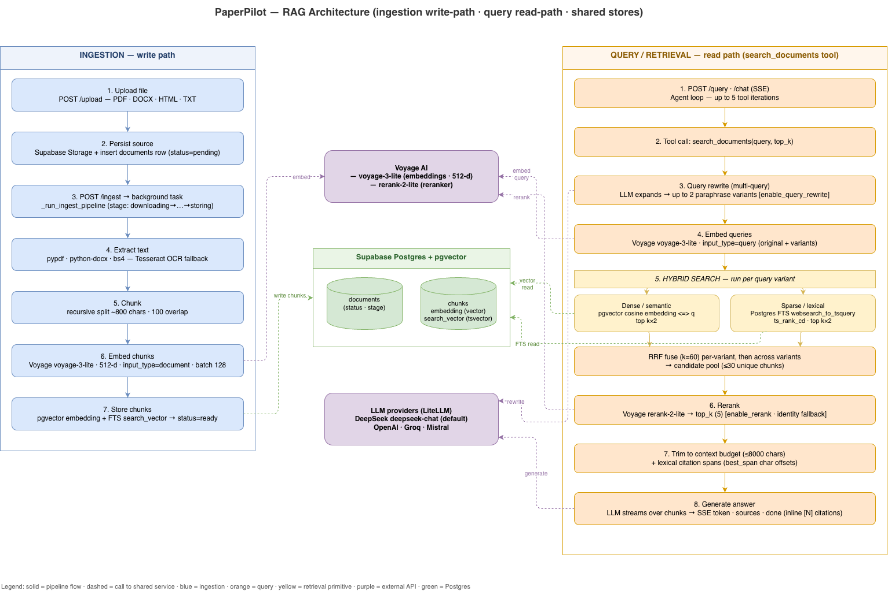
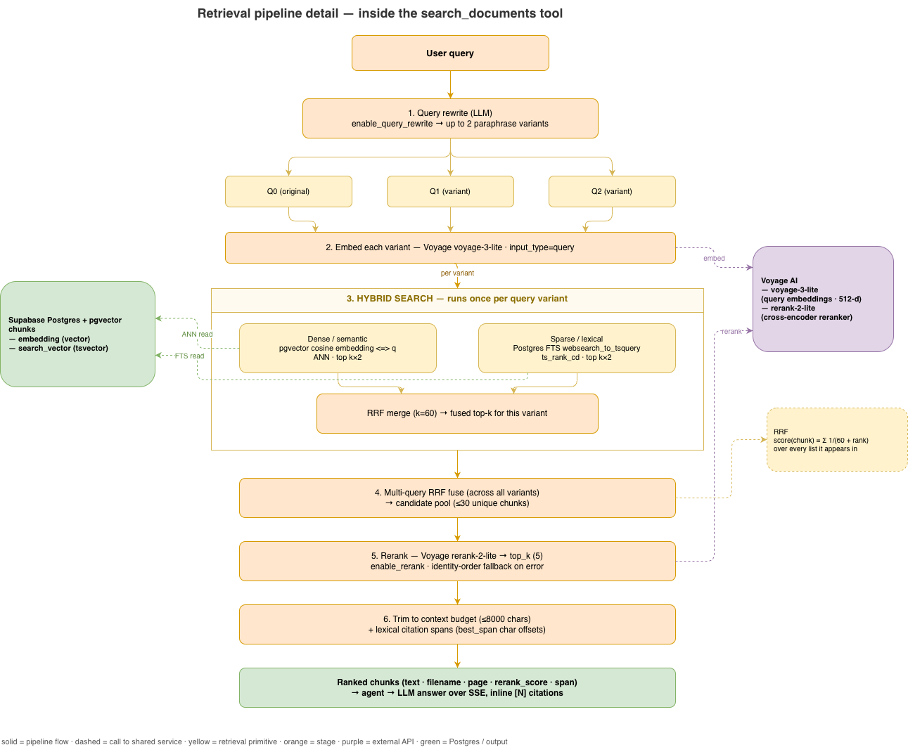

# RAG Architecture

> How PaperPilot turns uploaded documents into grounded, cited answers.
> Companion to [`../ingestion/ingestion-pipeline.md`](../ingestion/ingestion-pipeline.md),
> which covers the **reliability/observability** of the write path; this doc
> covers the **RAG mechanics** — chunking, retrieval, reranking, generation.



The source of truth is [`rag-architecture.drawio`](./rag-architecture.drawio)
(editable; `.drawio.png` / `.svg` are committed renders — see
[Re-rendering](#re-rendering)).

---

## The big picture

RAG splits into two paths that share one Postgres + pgvector store:

- **Write path (ingestion)** — runs once per upload. Extract → chunk → embed →
  store. Produces the searchable `chunks` rows.
- **Read path (query/retrieval)** — runs per question. Rewrite → embed → hybrid
  search → fuse → rerank → trim → generate. Consumes those chunks.

Two external services back both paths: **Voyage AI** (embeddings + reranker) and
the **LLM providers** (DeepSeek by default, via LiteLLM).

---

## Write path — how chunking works

Code: [`ingest.py`](../../../backend/src/paperpilot/ingest.py) →
[`chunk.py`](../../../backend/src/paperpilot/chunk.py) →
[`embed.py`](../../../backend/src/paperpilot/embed.py) →
[`store.py`](../../../backend/src/paperpilot/store.py).

1. **Extract** — per file type: `pypdf` (PDF), `python-docx` (DOCX),
   BeautifulSoup/`lxml` (HTML), plain read (TXT/MD). Image-only PDF pages fall
   back to **Tesseract OCR** (`pytesseract` + `pdf2image`, 300 dpi). Output is a
   list of `Page(page_num, text)` — so chunks keep page provenance.

2. **Chunk** — `chunk_pages(size=800, overlap=100)`. Recursive character split:
   it tries separators in order of decreasing semantic strength —
   `["\n\n", "\n", ". ", "! ", "? ", "; ", " ", ""]` — packing segments up to
   ~800 chars before falling to the next separator, and naive-slicing only as a
   last resort. A **100-char overlap** is prepended from the previous chunk so a
   sentence split across a boundary is still retrievable from both sides.
   Chunking is **per page**, so a chunk never straddles two pages and every chunk
   carries its `page` and a document-wide `ordinal`.

3. **Embed** — `embed_documents` calls Voyage **`voyage-3-lite`** (512-dim),
   `input_type="document"`, batched **128 texts/call**. (Asymmetric embeddings:
   documents and queries use different `input_type`s against the same model.)

4. **Store** — `insert_chunks` writes each chunk to `chunks` with its `embedding`
   cast to `pgvector`. The `search_vector` (Postgres `tsvector` for full-text
   search) is maintained by the table itself. Document `status` flips to `ready`.

**Why these numbers.** ~800 chars ≈ a tight paragraph — large enough to hold a
self-contained idea, small enough that a reranked top-5 fits the LLM context
budget. The 100-char (~12.5%) overlap is the standard recall-vs-storage trade.

---

## Read path — what retrieval we have

Code: [`agent.py`](../../../backend/src/paperpilot/agent.py) →
[`tools/search_docs.py`](../../../backend/src/paperpilot/tools/search_docs.py) →
[`query_rewrite.py`](../../../backend/src/paperpilot/query_rewrite.py) ·
[`retrieve.py`](../../../backend/src/paperpilot/retrieve.py) ·
[`rerank.py`](../../../backend/src/paperpilot/rerank.py) ·
[`citation.py`](../../../backend/src/paperpilot/citation.py).

A question enters the **agent loop** (`agent.run`, ≤5 tool iterations). When the
LLM calls `search_documents`, the full retrieval pipeline runs:



Source: [`retrieval-pipeline.drawio`](./retrieval-pipeline.drawio).

### 1. Query rewrite (multi-query expansion)
`expand_query` asks the LLM for up to **2** alternative phrasings
(`query_rewrite_variants=2`). The original + variants become the query set.
Best-effort: any failure degrades to `[original]`. Toggle: `enable_query_rewrite`.

### 2. Embed queries
`embed_queries` embeds every variant with Voyage `voyage-3-lite`,
`input_type="query"`.

### 3. Hybrid search — **two retrieval modes**, per variant
`hybrid_search` runs both and fuses them:

| Mode | Mechanism | Code |
|------|-----------|------|
| **Dense / semantic** | pgvector cosine distance `embedding <=> query` (ANN), fetch `k×2` | `store.search_vectors` |
| **Sparse / lexical** | Postgres FTS `websearch_to_tsquery` + `ts_rank_cd`, fetch `k×2` | `retrieve.keyword_search` |

The two result lists are merged with **Reciprocal Rank Fusion** (RRF, constant
`k=60`): each chunk scores `Σ 1/(60 + rank)` across the lists it appears in.
Dense catches paraphrase/synonym matches; sparse catches exact terms, IDs, and
rare tokens the embedding blurs. RRF needs no score calibration between them.

### 4. Multi-query fusion → candidate pool
`multi_query_search` RRF-fuses the per-variant hybrid results into one
deduplicated **candidate pool** of up to **30** chunks
(`retrieval_candidate_pool=30`).

### 5. Rerank
`rerank_documents` sends the pool + original query to Voyage
**`rerank-2-lite`** (a cross-encoder) and keeps the **top_k** (default **5**;
per-model override via `models.json` `retrieval_top_k`). Degrades to identity
order on disable/empty/error. Toggle: `enable_rerank`.

### 6. Context budget + citations
Reranked chunks are kept in order until the running text length would exceed
**8000 chars** (`retrieval_context_chars`; per-model override). For each kept
chunk, `best_span` computes the char offsets of the sentence with the most
query-term overlap — these power frontend citation highlighting. The tool
returns chunks with `filename`, `page`, `text`, `rerank_score`, `span_*`.

### 7. Generate
The agent feeds the chunks back to the LLM, which streams the answer over **SSE**
(`token` → `sources` → `done`) with inline `[N]` citations matching chunk order.
Default model **DeepSeek `deepseek-chat`** via LiteLLM (OpenAI/Groq/Mistral also
wired). The `/query` route is a thin single-iteration wrapper over the same agent
loop with only `search_documents` enabled ([`reader.py`](../../../backend/src/paperpilot/reader.py)).

**Retrieval summary — five techniques stacked:** dense vector · sparse FTS ·
RRF hybrid fusion · multi-query expansion · cross-encoder rerank.

---

## Scope enforcement

When the user picks documents in the chat UI, `doc_ids` threads through
`ToolContext` into every SQL query (`search_vectors`, `keyword_search` both
`AND c.document_id = ANY(...)`). Agents cannot read outside the selected scope;
the system prompt is also rebuilt per-request to name the in-scope IDs.

---

## Key parameters

| Parameter | Default | Where |
|-----------|---------|-------|
| Chunk size / overlap | 800 / 100 chars | `chunk.py` |
| Embedding model / dim | `voyage-3-lite` / 512 | `config.py` |
| Embed batch size | 128 | `embed.py` |
| Query rewrite variants | 2 | `config.py` `query_rewrite_variants` |
| RRF constant | 60 | `retrieve.py` |
| Candidate pool | 30 | `config.py` `retrieval_candidate_pool` |
| Rerank model | `rerank-2-lite` | `config.py` |
| top_k | 5 (per-model in `models.json`) | `config.py` `retrieval_top_k` |
| Context budget | 8000 chars (per-model) | `config.py` `retrieval_context_chars` |
| Agent max iterations | 5 | `config.py` |
| Feature toggles | `enable_rerank`, `enable_query_rewrite` | `config.py` |

---

## Cross-check vs the ingestion doc

The ingestion doc's pipeline (`downloading → extracting → chunking → embedding →
storing`) matches the write path here — this doc just adds the **what/why** of
chunking and embedding rather than the stage/retry/observability machinery.
No contradictions found. One nuance worth flagging: that doc's *embedding* stage
corresponds to step 3 here (`embed_documents`, batches of 128 off the event loop
with retry); the *storing* stage is step 4.

---

## Diagrams in this directory

| File | What it shows |
|------|---------------|
| [`rag-architecture.png`](./rag-architecture.png) / [`.svg`](./rag-architecture.svg) | Overall architecture — both paths + shared stores |
| [`retrieval-pipeline.png`](./retrieval-pipeline.png) / [`.svg`](./retrieval-pipeline.svg) | Zoom into `search_documents` — rewrite → hybrid → RRF → rerank |

The `.drawio` files are the source of truth; the `.png`/`.svg` are committed
renders (the `.drawio.png` variants embed the editable XML).

## Re-rendering

Regenerate the committed renders with the draw.io desktop CLI:

```bash
cd docs/design/RAG
for d in rag-architecture retrieval-pipeline; do
  drawio -x -f png -e -s 2 -o "$d.drawio.png" "$d.drawio"
  drawio -x -f svg -e        -o "$d.svg"       "$d.drawio"
  # preview (no -e, vision-safe): drawio -x -f png --width 2000 -o "$d.png" "$d.drawio"
done
```
