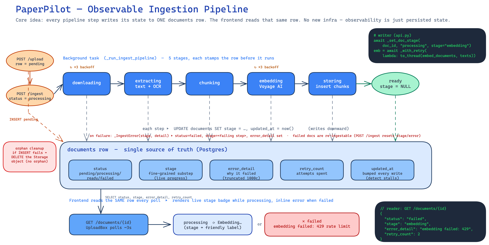
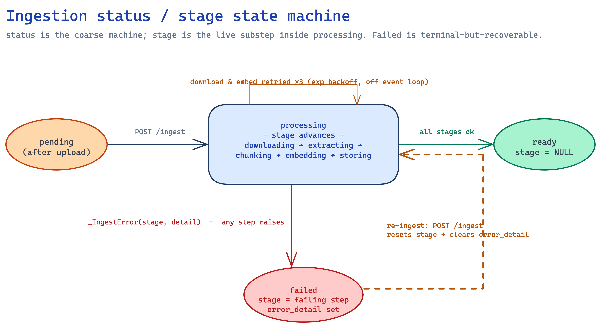

# Ingestion Pipeline — Reliable & Observable

> Shipped in PR #23. Covers **how** the ingestion pipeline reports its own
> progress and **how** it survives transient failures.

## Problem

Ingestion used to be a black box. The `documents.status` flipped
`pending → processing → ready`/`failed`, and that was the only visible signal.
When something broke you saw `failed` — with no indication of *which* step died,
*why*, and no way to watch progress on a slow document. A network blip during
embedding meant a permanent `failed` with the reason buried in server logs.

Two goals:

- **Observable** — see where a document is in the pipeline, live, and see the
  reason when it fails.
- **Reliable** — survive transient failures (network, rate limits), don't block
  the event loop, and never leave orphaned Storage objects behind.

---

## The big picture



The whole design rests on one idea:

> **Every pipeline step writes its state to one `documents` row. The frontend
> reads that same row. Observability is just persisted state — no new infra,
> no logging pipeline, no websocket.**

- **Top lane** — the background task (`_run_ingest_pipeline`) walks five stages:
  `downloading → extracting → chunking → embedding → storing`. *Before* each step
  runs, it stamps the row (`UPDATE documents SET stage = …, updated_at = now()`).
- **Middle band** — the `documents` row, the single source of truth. The new
  columns (`stage`, `error_detail`, `retry_count`, `updated_at`) live here.
- **Bottom lane** — the frontend (`UploadBox`) already polls
  `GET /documents/{id}` every ~3s. Each poll now returns `stage` and
  `error_detail`, so it renders a live label ("Embedding…") or, on failure, the
  inline error.

The arrows *into* the band are writes; the arrow *out* is the poll read. That's
the entire mechanism.

---

## State machine



`status` stays the coarse, frontend-facing machine. `stage` is the fine-grained
substep that only has meaning while `status = processing`.

| status | meaning | stage |
|--------|---------|-------|
| `pending` | row inserted after upload, not yet ingested | — |
| `processing` | background task running | `downloading`/`extracting`/`chunking`/`embedding`/`storing` |
| `ready` | chunks stored, searchable | `NULL` (cleared) |
| `failed` | a step raised | the failing step (kept for debugging) |

`failed` is **terminal-but-recoverable**: re-`POST /ingest` on a failed document
is allowed and resets `stage`/`error_detail` before retrying. (`ready` and
`processing` are rejected with `409`.)

---

## How observability works

### 1. `stage` → live progress

Each step opens a short-lived DB session and stamps the stage before doing its
work:

```python
# api.py — _run_ingest_pipeline
await _set_doc_stage(doc_id, "processing", stage="embedding")
embedding = await _with_retry(
    lambda: asyncio.to_thread(embed_documents, texts), label="embed", log=log
)
```

`_set_doc_stage` is a thin helper over `store.update_document_status`, which
always also bumps `updated_at`. The frontend maps the raw stage to a friendly
label:

```ts
// UploadBox.tsx
const STAGE_LABELS = {
  downloading: "Downloading", extracting: "Extracting text",
  chunking: "Chunking", embedding: "Embedding", storing: "Saving",
};
```

### 2. `error_detail` → why it failed

A typed exception carries the failing stage and a message up to one handler:

```python
class _IngestError(Exception):
    def __init__(self, stage: str, detail: str) -> None:
        self.stage = stage
        self.detail = detail

# one handler persists it (truncated to 1000 chars)
except _IngestError as exc:
    await _set_doc_stage(doc_id, "failed", stage=exc.stage, error_detail=exc.detail)
```

`DocumentOut` returns `error_detail`; `UploadBox` renders it in red under the
failed document. So instead of "failed" you see
*"no extractable text — document is empty or image-only"* or
*"embedding failed: 429 rate limit"*.

### 3. `updated_at` → stall detection

Every status write bumps `updated_at`, and there's an index on
`(status, updated_at)`. A document stuck in `processing` with an old
`updated_at` is a stalled ingest — queryable, not invisible.

---

## How reliability works

| Mechanism | What | Why |
|-----------|------|-----|
| **Retries** | `_with_retry` wraps **download** and **embed** with 3 attempts, exponential backoff (`asyncio.sleep`, capped 8s) | These are the transient/network steps. Extraction is deterministic — retrying a corrupt file just wastes time, so it isn't retried. |
| **Off the event loop** | `extract_text` (OCR-heavy) and `embed_documents` run via `asyncio.to_thread` | They're blocking/CPU-bound. Running them inline in the async background task would stall every other request. |
| **Explicit empty-doc failure** | zero chunks → `_IngestError("chunking", "…image-only")` | Previously a scanned-image PDF with no OCR text would silently store nothing and report `ready`. |
| **Orphan cleanup** | `/upload` deletes the Storage object if the `documents` INSERT fails | The object is already uploaded but has no row pointing at it — an unreachable orphan. Best-effort delete prevents accumulation. |

---

## Schema

Migration `supabase/migrations/20260605120000_add_ingestion_observability.sql`:

```sql
ALTER TABLE documents
    ADD COLUMN IF NOT EXISTS stage        text,
    ADD COLUMN IF NOT EXISTS error_detail text,
    ADD COLUMN IF NOT EXISTS retry_count  integer NOT NULL DEFAULT 0,
    ADD COLUMN IF NOT EXISTS updated_at   timestamptz;

CREATE INDEX IF NOT EXISTS documents_status_updated_idx
    ON documents (status, updated_at);   -- find stalled ingests
```

---

## Code map

| File | Role in this design |
|------|---------------------|
| `backend/src/paperpilot/api.py` | `_run_ingest_pipeline` (the staged pipeline), `_set_doc_stage`, `_with_retry`, `_IngestError`, `_download_source`; orphan cleanup in `upload_file` |
| `backend/src/paperpilot/store.py` | `update_document_status(status, *, stage, error_detail, increment_retry)` — writes the row, always bumps `updated_at`; `list_documents`/`get_document` now select the new columns |
| `backend/src/paperpilot/models.py` | `DocumentOut` gains `stage`, `error_detail`, `retry_count` |
| `frontend/src/lib/api.ts` | `DocumentSummary` type with the new fields |
| `frontend/src/components/UploadBox.tsx` | `STAGE_LABELS`, `statusLabel()`, inline error rendering |

---

## Deferred

A worker / job-queue (Celery, RQ, Supabase Queues) was **not** adopted. The
FastAPI `BackgroundTasks` runner is sufficient at current scale; the observability
columns above give most of the debuggability a queue would, without the infra.
Revisit if ingestion volume or multi-step orchestration grows.

---

## Re-rendering the diagrams

The `.excalidraw` sources are the source of truth; the `.png`s are committed
renders. To regenerate after editing:

```bash
cd .claude/skills/excalidraw-diagram/references
uv run python render_excalidraw.py ../../../../docs/design/ingestion-pipeline.excalidraw
uv run python render_excalidraw.py ../../../../docs/design/ingestion-states.excalidraw
```
