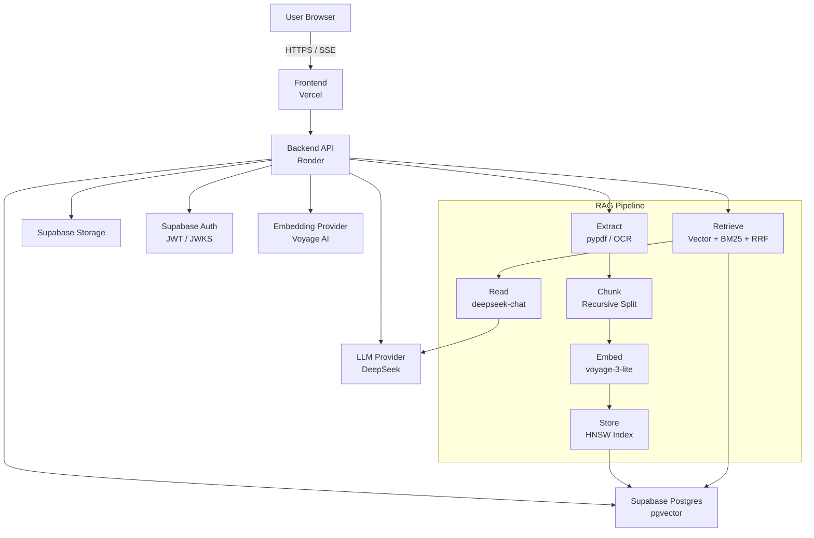
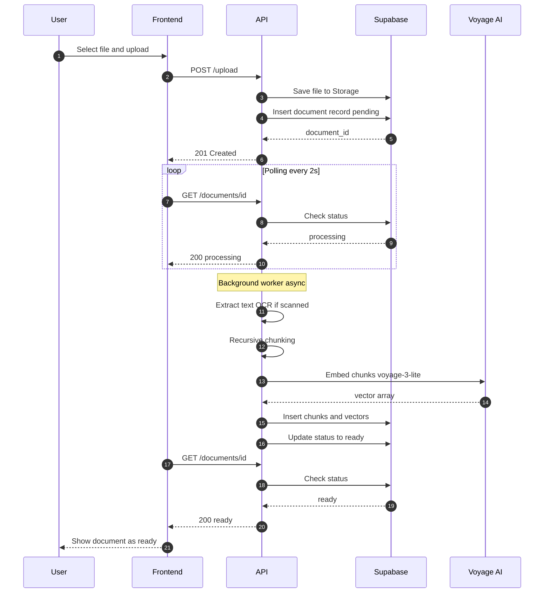
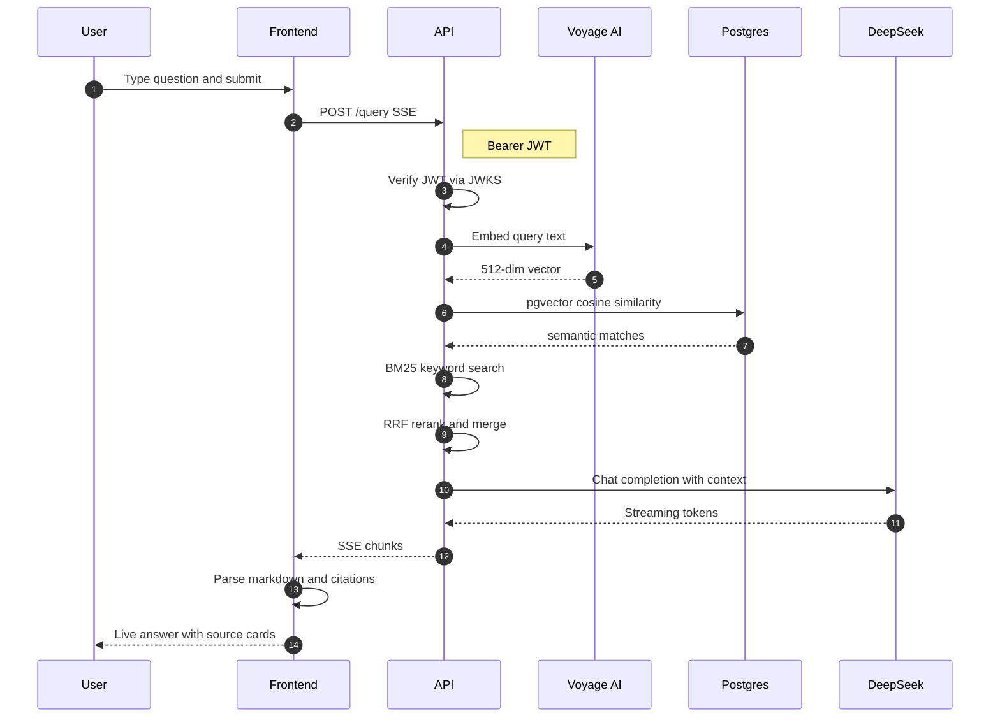
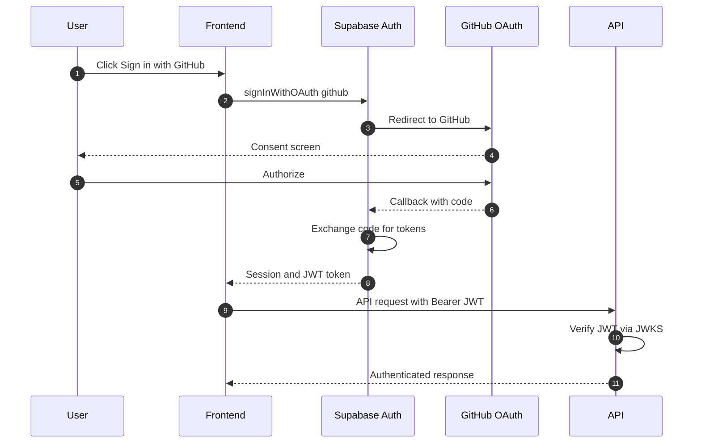

# PaperPilot

> Your documents, understood. Ask questions in plain English and get cited, sourced answers from your uploaded files.

**PaperPilot** is a production-ready **Retrieval-Augmented Generation (RAG)** application that lets users upload documents (PDF, DOCX, TXT, MD, HTML), processes them into searchable semantic chunks, and answers natural-language questions with inline citations and source provenance.

<p align="center">
  <a href="https://paperpilot.leongxinnan.com">Live Demo</a> ·
  <a href="#features">Features</a> ·
  <a href="#architecture">Architecture</a> ·
  <a href="#quick-start">Quick Start</a> ·
  <a href="#deployment">Deployment</a>
</p>

---

## Features

- **Multi-format ingestion** — Upload PDF, DOCX, TXT, MD, or HTML files up to 20 MB.
- **OCR fallback** — Scanned PDF pages are automatically extracted with Tesseract OCR.
- **Semantic + lexical retrieval** — Hybrid search combining pgvector ANN similarity with BM25, merged via Reciprocal Rank Fusion (RRF).
- **Streaming answers** — Real-time token-by-token responses from DeepSeek with clickable inline citations (`[1]`, `[2]`, …).
- **Source provenance** — Every answer shows the retrieved source cards with filename, page number, and text snippet.
- **Auth & security** — GitHub OAuth via Supabase Auth; JWT verification on every API call; Row Level Security (RLS) in Postgres; per-user rate limiting.
- **Feedback loop** — Thumbs up/down on assistant messages to collect ratings for future improvements.
- **Dark/light mode** — Theme toggle with system preference detection.

---

## Architecture



### Document Upload & Ingestion Flow



### Query & Answer Flow



### Authentication Flow



### Core Pipeline

1. **Extract** — `pypdf` (with OCR fallback), `python-docx`, `BeautifulSoup`.
2. **Chunk** — Recursive semantic splitting (≈800 chars, 100-char overlap).
3. **Embed** — Voyage AI `voyage-3-lite` (512-dim vectors).
4. **Store** — Supabase Postgres with `pgvector` HNSW index.
5. **Retrieve** — Cosine similarity + BM25 + RRF reranking.
6. **Read** — DeepSeek `deepseek-chat` with a citation-enforcing system prompt.

---

## Tech Stack

| Layer | Technology |
|-------|-----------|
| **Backend** | Python 3.11, FastAPI, Uvicorn |
| **Frontend** | React 19, Vite, TypeScript, Tailwind CSS v4, shadcn/ui |
| **Database** | Supabase Postgres + `pgvector` |
| **Auth** | Supabase Auth (GitHub OAuth) |
| **Embeddings** | Voyage AI `voyage-3-lite` |
| **LLM** | DeepSeek `deepseek-chat` |
| **OCR** | Tesseract + `pdf2image` |
| **Infra** | Vercel (frontend), Render (backend), Supabase (data/auth/storage) |
| **CI/CD** | GitHub Actions (Supabase migrations) |

---

## Quick Start

### Prerequisites

- Python 3.11
- Node.js 20+ and `pnpm`
- A [Supabase](https://supabase.com) project with **pgvector** enabled
- API keys for [DeepSeek](https://deepseek.com) and [Voyage AI](https://voyageai.com)
- (Optional) Tesseract OCR installed locally

### 1. Clone & env files

```bash
git clone https://github.com/<your-org>/paperpilot.git
cd paperpilot

# Backend
cp backend/.env.example backend/.env
# Frontend
cp frontend/.env.local.example frontend/.env.local   # create from example if needed
```

Fill in the keys in both `.env` files.

### 2. Backend

```bash
cd backend
uv sync                          # install dependencies
uv run uvicorn paperpilot.api:app --reload
```

The API will be available at `http://localhost:8000`.

### 3. Frontend

```bash
cd frontend
pnpm install
pnpm dev
```

The UI will be available at `http://localhost:5173`.

### 4. Database migrations

```bash
supabase db push
```

> Ensure your Supabase CLI is linked to the correct project.

---

## Project Structure

```
paperpilot/
├── backend/
│   ├── src/paperpilot/          # FastAPI app & RAG pipeline
│   │   ├── api.py               # Routes, middleware, CORS
│   │   ├── auth.py              # JWT verification (Supabase JWKS)
│   │   ├── ingest.py            # File extraction + OCR
│   │   ├── chunk.py             # Recursive text splitting
│   │   ├── embed.py             # Voyage AI embeddings
│   │   ├── retrieve.py          # Hybrid search (vector + BM25 + RRF)
│   │   ├── reader.py            # LLM prompt & SSE streaming
│   │   ├── store.py             # DB operations
│   │   └── cli.py               # Local CLI: ingest, ask
│   ├── Dockerfile
│   ├── pyproject.toml
│   └── uv.lock
├── frontend/
│   ├── src/
│   │   ├── pages/               # AppPage, Login
│   │   ├── components/          # ChatBox, Sidebar, UploadBox, ThemeToggle
│   │   ├── hooks/               # useSession
│   │   └── lib/                 # API client, Supabase init, utils
│   ├── package.json
│   └── vite.config.ts
├── supabase/
│   └── migrations/              # Postgres schema & RLS policies
├── render.yaml                  # Render web-service blueprint
└── README.md
```

---

## API Overview

| Method | Path | Description |
|--------|------|-------------|
| `GET` | `/health` | Health check (Render) |
| `GET` | `/me` | Current authenticated user |
| `POST` | `/upload` | Upload file to Supabase Storage |
| `POST` | `/ingest` | Trigger background ingestion |
| `GET` | `/documents` | List user's documents |
| `GET` | `/documents/{id}` | Get document status |
| `POST` | `/query` | Ask a question — returns SSE stream |
| `POST` | `/feedback` | Submit thumbs up/down |

---

## Deployment

### Frontend (Vercel)

1. Import the `frontend/` directory into Vercel.
2. Set environment variables: `VITE_API_URL`, `VITE_SUPABASE_URL`, `VITE_SUPABASE_PUBLISHABLE_KEY`.
3. Deploy.

### Backend (Render)

1. Push `render.yaml` to Render Blueprints, or create a Docker web service from the `backend/` directory.
2. Set all `sync: false` environment variables in the Render Dashboard.
3. Health check: `/health` on port `10000`.

### Database (Supabase)

- Migrations in `supabase/migrations/` are automatically pushed to production on every merge to `main` via GitHub Actions (`.github/workflows/supabase-prod.yml`).
- Enable the **pgvector** extension in your Supabase project.

---

## Environment Variables

### Backend

| Variable | Description |
|----------|-------------|
| `SUPABASE_URL` | Supabase project URL |
| `SUPABASE_JWKS_URL` | JWKS endpoint for JWT verification |
| `SUPABASE_SECRET_KEY` | Backend secret key (bypasses RLS) |
| `SUPABASE_DB_URL` | Postgres connection string |
| `DEEPSEEK_API_KEY` | DeepSeek API key |
| `VOYAGE_API_KEY` | Voyage AI API key |
| `FRONTEND_ORIGINS` | Comma-separated CORS origins |

### Frontend

| Variable | Description |
|----------|-------------|
| `VITE_API_URL` | Backend API base URL |
| `VITE_SUPABASE_URL` | Supabase project URL |
| `VITE_SUPABASE_PUBLISHABLE_KEY` | Frontend-safe publishable key |

---

## Development Commands

| Task | Command |
|------|---------|
| Backend dev server | `uv run uvicorn paperpilot.api:app --reload` |
| Backend CLI | `uv run python -m paperpilot.cli <ingest \| ask>` |
| Backend lint | `uv run ruff check . && uv run ruff format .` |
| Backend typecheck | `pyright` or `mypy` |
| Frontend dev server | `pnpm dev` |
| Frontend build | `pnpm build` |
| Frontend lint | `pnpm lint` |

---

## License

[MIT](LICENSE)

---

<p align="center">
  Built with <a href="https://fastapi.tiangolo.com">FastAPI</a>,
  <a href="https://react.dev">React</a>, and
  <a href="https://supabase.com">Supabase</a>.
</p>
