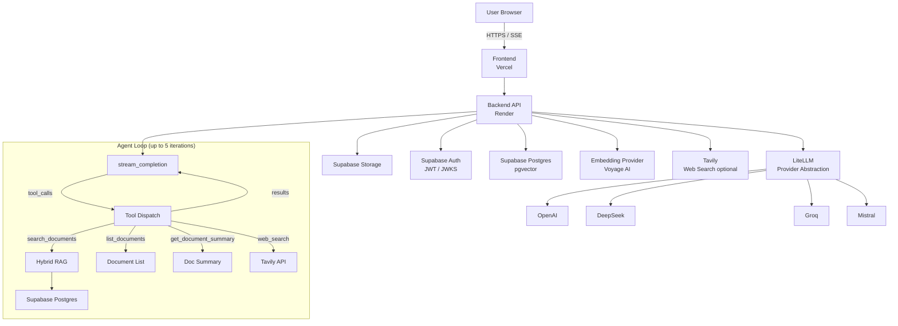
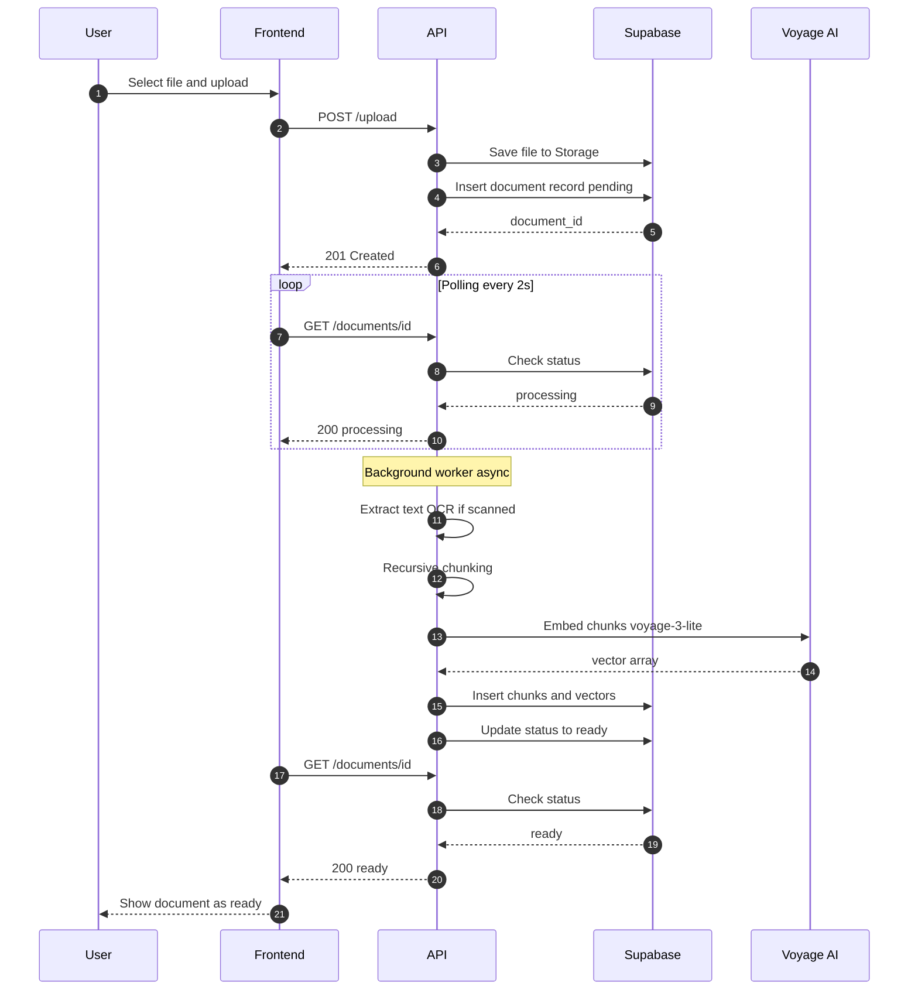
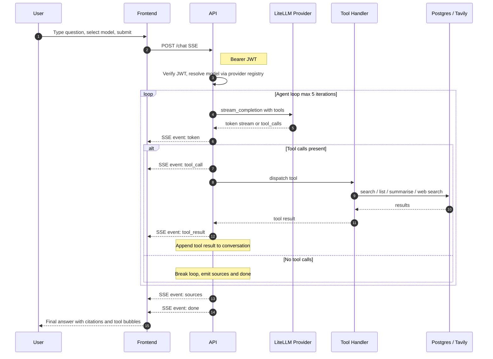
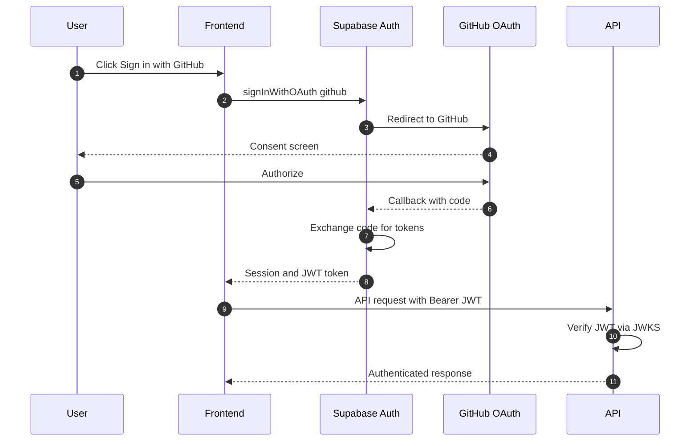

# PaperPilot

> Your documents, understood. Ask questions in plain English and get cited, sourced answers from your uploaded files — powered by an agentic loop with tool calling and multi-provider LLM support.

**PaperPilot** is a production-ready **agentic RAG** application that lets users upload documents (PDF, DOCX, TXT, MD, HTML), processes them into searchable semantic chunks, and answers natural-language questions through an agent loop that calls tools, retrieves context, and streams cited answers in real time.

<p align="center">
  <a href="https://paperpilot.leongxinnan.com">Live Demo</a> ·
  <a href="#features">Features</a> ·
  <a href="#architecture">Architecture</a> ·
  <a href="#quick-start">Quick Start</a> ·
  <a href="#deployment">Deployment</a>
</p>

---

## Features

- **Multi-format ingestion** — Upload PDF, DOCX, TXT, MD, or HTML files up to 20 MB.
- **OCR fallback** — Scanned PDF pages are automatically extracted with Tesseract OCR.
- **Semantic + lexical retrieval** — Hybrid search combining pgvector ANN similarity with Postgres full-text search (`tsvector`/`ts_rank_cd`), merged via Reciprocal Rank Fusion (RRF).
- **Query rewriting + reranking** — `search_documents` expands each query into multiple variants (multi-query), fuses their results into a candidate pool, then reorders by relevance with Voyage `rerank-2-lite`. Retrieval depth (`top_k`) and context budget are configurable per model in `backend/models.json`. Rewrite and rerank are independently toggleable and degrade gracefully to plain hybrid search on failure.
- **Agentic tool loop** — The assistant decides which tools to call (up to 5 iterations) and synthesises a final answer from the results.
- **Built-in tools** — `search_documents` (hybrid RAG), `list_documents`, `get_document_summary`, and optional `web_search` (Tavily).
- **Multi-provider LLM** — Switch between OpenAI (gpt-4o, gpt-4o-mini), DeepSeek (deepseek-chat), Groq (llama-3.3-70b), and Mistral (mistral-large) per message. The provider/model registry lives in `backend/models.json` — add models, flip per-provider or per-model `enabled` flags, and mark one model as `default: true` without touching code. Models only surface if their provider is enabled, the model is enabled, and the API key env var is set.
- **Per-message model selection** — Pick any available model from the chat footer before each send. Selection is held in a `<ModelProvider>` React context and persists across reloads via `localStorage`.
- **Inline tool activity** — Tool calls and results render as collapsible bubbles in the chat so you can see exactly what the agent did.
- **Streaming answers** — Real-time token-by-token responses with clickable inline citations (`[1]`, `[2]`, …). Rendered via `streamdown`, which handles partial / unterminated markdown blocks gracefully mid-stream.
- **Provider-agnostic formatting** — The system prompt constrains the LLM to a restricted Markdown subset (paragraphs, `**bold**`, lists, code, citations) so output looks consistent whether the answer came from DeepSeek, OpenAI, Groq, or Mistral.
- **Source provenance** — Every answer shows retrieved source cards with filename, page number, and text snippet, with the best-matching sentence highlighted (lexical citation span).
- **Persistent chat history** — All conversations stored in Supabase, synced across devices. Chat list in the sidebar; click any past chat to resume.
- **Per-chat document scope** — Each chat has its own attached documents. Pick from already-uploaded docs via "Add docs" — no re-uploading needed. Attached filenames stay visible after the picker closes and when you reopen a chat.
- **Document deletion** — Hard-delete any uploaded document from the Documents panel. Removes the file from Storage, all text chunks, and embeddings with no recovery. Deleted docs are automatically removed from all active chat sessions.
- **Auth & security** — GitHub OAuth via Supabase Auth; JWT verification on every API call; Row Level Security in Postgres; per-user rate limiting.
- **Feedback loop** — Thumbs up/down on assistant messages.
- **Dark/light mode** — Theme toggle with system preference detection.

---

## Architecture



### Document Upload & Ingestion Flow



### Agent Chat Flow



### Authentication Flow



### Core Pipeline

1. **Extract** — `pypdf` (with OCR fallback), `python-docx`, `BeautifulSoup`.
2. **Chunk** — Recursive semantic splitting (≈800 chars, 100-char overlap).
3. **Embed** — Voyage AI `voyage-3-lite` (512-dim vectors).
4. **Store** — Supabase Postgres with `pgvector` HNSW index.
5. **Retrieve** — Multi-query expansion → cosine similarity + Postgres FTS (`tsvector`/`ts_rank_cd`) fused via RRF → Voyage `rerank-2-lite` reranking → per-model `top_k`/context budget → lexical citation spans.
6. **Agent** — LiteLLM provider abstraction, tool loop (up to 5 iterations), SSE streaming.

---

## Tech Stack

| Layer | Technology |
|-------|-----------|
| **Backend** | Python 3.11, FastAPI, Uvicorn |
| **LLM Abstraction** | LiteLLM (OpenAI, DeepSeek, Groq, Mistral) |
| **Frontend** | React 19, Vite, TypeScript, Tailwind CSS v4, shadcn/ui, `streamdown` (LLM-streaming markdown) |
| **Database** | Supabase Postgres + `pgvector` |
| **Auth** | Supabase Auth (GitHub OAuth) |
| **Embeddings** | Voyage AI `voyage-3-lite` |
| **Web Search** | Tavily API (optional) |
| **OCR** | Tesseract + `pdf2image` |
| **Infra** | Vercel (frontend), Render (backend), Supabase (data/auth/storage) |
| **CI/CD** | GitHub Actions (Supabase migrations) |

---

## Quick Start

### Prerequisites

- Python 3.11
- Node.js 20+ and `pnpm`
- A [Supabase](https://supabase.com) project with **pgvector** enabled
- API keys for at least one LLM provider (DeepSeek recommended) and [Voyage AI](https://voyageai.com)
- (Optional) Tesseract OCR installed locally

### 1. Clone & env files

```bash
git clone https://github.com/<your-org>/paperpilot.git
cd paperpilot

cp backend/.env.example backend/.env
```

Fill in at minimum `SUPABASE_*`, `VOYAGE_API_KEY`, and one LLM key (e.g. `DEEPSEEK_API_KEY`).

### 2. Backend

```bash
cd backend
uv sync
uv run uvicorn paperpilot.api:app --reload
```

The API will be available at `http://localhost:8000`.

### 3. Frontend

```bash
cd frontend
pnpm install
pnpm dev
```

The UI will be available at `http://localhost:5173`.

### 4. Database migrations

```bash
supabase db push
```

> Ensure your Supabase CLI is linked to the correct project.

---

## Project Structure

```
paperpilot/
├── backend/
│   ├── models.json              # Provider + model manifest (loaded at import)
│   ├── src/paperpilot/
│   │   ├── api.py               # Routes, middleware, CORS, tool registration
│   │   ├── agent.py             # Agentic loop — stream_completion + tool dispatch
│   │   ├── providers.py         # Loads models.json; exposes available_models/providers + resolve + default_model
│   │   ├── llm.py               # LiteLLM streaming + non-streaming (complete) wrappers
│   │   ├── tools/
│   │   │   ├── __init__.py      # ToolSpec, ToolContext, REGISTRY, dispatch()
│   │   │   ├── search_docs.py   # search_documents tool (rewrite → fuse → rerank → spans)
│   │   │   ├── docs.py          # list_documents + get_document_summary tools
│   │   │   └── web_search.py    # web_search tool (Tavily, optional)
│   │   ├── auth.py              # JWT verification (Supabase JWKS)
│   │   ├── ingest.py            # File extraction + OCR
│   │   ├── chunk.py             # Recursive text splitting
│   │   ├── embed.py             # Voyage AI embeddings (embed_documents/embed_queries)
│   │   ├── retrieve.py          # Hybrid search + multi_query_search (vector + FTS + RRF)
│   │   ├── rerank.py            # Voyage rerank-2-lite (graceful identity fallback)
│   │   ├── query_rewrite.py     # LLM multi-query expansion (graceful fallback)
│   │   ├── citation.py          # Lexical best-span for source highlighting
│   │   ├── reader.py            # /query shim → agent.run (backward compat)
│   │   ├── store.py             # DB operations
│   │   └── cli.py               # Local CLI: ingest, ask
│   ├── tests/
│   ├── Dockerfile
│   ├── pyproject.toml
│   └── uv.lock
├── frontend/
│   ├── src/
│   │   ├── pages/               # AppPage, Login
│   │   ├── components/
│   │   │   ├── ChatBox.tsx          # Main chat UI, SSE handling, parts rendering
│   │   │   ├── MarkdownContent.tsx  # Streamdown wrapper + citation buttons
│   │   │   ├── ErrorBoundary.tsx    # Per-chat boundary so one bad message can't kill the session
│   │   │   ├── ModelProvider.tsx    # Context: fetches /models, persists selection, exposes grouping + badge helpers
│   │   │   ├── ModelPicker.tsx      # Propless picker; reads ModelProvider context, renders <optgroup> per provider
│   │   │   ├── ToolCallBubble.tsx   # Inline tool activity display
│   │   │   ├── Sidebar.tsx
│   │   │   ├── UploadBox.tsx
│   │   │   ├── BrandMark.tsx        # Shared paper-plane logo (sidebar, chat empty-state, landing)
│   │   │   └── ThemeToggle.tsx
│   │   ├── hooks/
│   │   │   ├── useChatSessions.ts
│   │   │   ├── useThemeTransition.ts # Shared circular theme-switch reveal (both toggles)
│   │   │   └── useSession.ts
│   │   └── lib/                 # API client, Supabase init, remarkCitations plugin, utils
│   ├── package.json
│   └── vite.config.ts
├── supabase/
│   └── migrations/              # Postgres schema & RLS policies
├── render.yaml
└── readme.md
```

---

## API Overview

| Method | Path | Description |
|--------|------|-------------|
| `GET` | `/health` | Health check (Render) |
| `GET` | `/me` | Current authenticated user |
| `GET` | `/models` | List enabled providers + models (manifest- and env-gated); includes `default_model_id` |
| `POST` | `/chat` | Agentic chat turn — returns SSE stream |
| `POST` | `/upload` | Upload file to Supabase Storage |
| `POST` | `/ingest` | Trigger background ingestion |
| `GET` | `/documents` | List user's documents |
| `GET` | `/documents/{id}` | Get document status |
| `DELETE` | `/documents/{id}` | Hard-delete document, all chunks, and Storage file |
| `POST` | `/query` | Legacy RAG query — backward-compat shim for `/chat` |
| `POST` | `/feedback` | Submit thumbs up/down |

> Chat session storage is handled directly by the frontend via the Supabase JS client.

### SSE Event Surface (`POST /chat`)

| Event | Payload | Description |
|-------|---------|-------------|
| `token` | `string` | Streamed text token |
| `tool_call` | `{id, name, args}` | Agent is calling a tool |
| `tool_result` | `{id, result}` | Tool execution result |
| `sources` | `chunk[]` | Retrieved document chunks |
| `done` | `""` | Stream complete |

---

## Deployment

### Frontend (Vercel)

1. Import the `frontend/` directory into Vercel.
2. Set environment variables: `VITE_API_URL`, `VITE_SUPABASE_URL`, `VITE_SUPABASE_PUBLISHABLE_KEY`.
3. Deploy.

### Backend (Render)

1. Push `render.yaml` to Render Blueprints, or create a Docker web service from the `backend/` directory.
2. Set all `sync: false` environment variables in the Render Dashboard.
3. Health check: `/health` on port `10000`.

#### Keep-warm (avoiding cold starts)

Render's free tier spins the container down after **15 minutes** of inactivity; the next request then eats a ~30–60s cold start. To keep it warm, an external uptime monitor pings `/health` on a fixed interval.

We use [cron-job.org](https://cron-job.org) (free, honours the interval):

1. Sign up and verify your email.
2. **Create cronjob** → **Title:** `paperpilot keep-warm`.
3. **URL:** `https://<your-render-url>/health`
4. **Request method:** GET.
5. **Schedule:** every 10 minutes (stay under the 15-min idle window).
6. **Expected status:** 200 (enables failure alerts).
7. Save, enable, and use **Test run** to confirm a 200.

> Permanent fix without any pinger: upgrade Render to the **Starter** tier ($7/mo), which has no spin-down.

### Database (Supabase)

- Migrations in `supabase/migrations/` are automatically pushed to production on every merge to `main` via GitHub Actions.
- Enable the **pgvector** extension in your Supabase project.

---

## Environment Variables

### Backend

| Variable | Required | Description |
|----------|----------|-------------|
| `SUPABASE_URL` | Yes | Supabase project URL |
| `SUPABASE_JWKS_URL` | Yes | JWKS endpoint for JWT verification |
| `SUPABASE_SECRET_KEY` | Yes | Backend secret key (bypasses RLS) |
| `SUPABASE_DB_URL` | Yes | Postgres connection string |
| `VOYAGE_API_KEY` | Yes | Voyage AI embeddings key |
| `DEEPSEEK_API_KEY` | LLM key* | Enables `deepseek-chat` |
| `OPENAI_API_KEY` | LLM key* | Enables `gpt-4o` and `gpt-4o-mini` |
| `OPENAI_ORGANIZATION` | No | Required only if your OpenAI key is scoped to an organization (`org-…`) |
| `OPENAI_PROJECT_ID` | No | Required only if your OpenAI key targets a specific project (`proj_…`) |
| `GROQ_API_KEY` | LLM key* | Enables `llama-3.3-70b` |
| `MISTRAL_API_KEY` | LLM key* | Enables `mistral-large` |
| `TAVILY_API_KEY` | No | Enables `web_search` tool |
| `DEFAULT_MODEL_ID` | No | Fallback when no model in `backend/models.json` is marked `default: true` |
| `AGENT_MAX_ITERATIONS` | No | Max tool-call iterations (default `5`) |
| `ENABLE_RERANK` | No | Toggle Voyage reranking in `search_documents` (default `true`) |
| `ENABLE_QUERY_REWRITE` | No | Toggle multi-query expansion (default `true`) |
| `RERANK_MODEL` | No | Voyage rerank model (default `rerank-2-lite`) |
| `QUERY_REWRITE_VARIANTS` | No | Extra query variants per search (default `2`) |
| `RETRIEVAL_TOP_K` | No | Global default chunks returned, per-model overridable (default `5`) |
| `RETRIEVAL_CANDIDATE_POOL` | No | Candidate pool size sent to the reranker (default `30`) |
| `RETRIEVAL_CONTEXT_CHARS` | No | Global default context-char cap, per-model overridable (default `8000`) |
| `FRONTEND_ORIGINS` | Yes | Comma-separated CORS origins |

> *At least one LLM key must be set.

### Frontend

| Variable | Description |
|----------|-------------|
| `VITE_API_URL` | Backend API base URL |
| `VITE_SUPABASE_URL` | Supabase project URL |
| `VITE_SUPABASE_PUBLISHABLE_KEY` | Frontend-safe publishable key |

---

## Development Commands

| Task | Command |
|------|---------|
| Backend dev server | `uv run uvicorn paperpilot.api:app --reload` |
| Backend tests | `uv run pytest` |
| Backend lint | `uv run ruff check . && uv run ruff format .` |
| Backend typecheck | `pyright` or `mypy` |
| Frontend dev server | `pnpm dev` |
| Frontend build | `pnpm build` |
| Frontend lint | `pnpm lint` |

---

## License

[MIT](LICENSE)

---

<p align="center">
  Built with <a href="https://fastapi.tiangolo.com">FastAPI</a>,
  <a href="https://react.dev">React</a>, and
  <a href="https://supabase.com">Supabase</a>.
</p>
